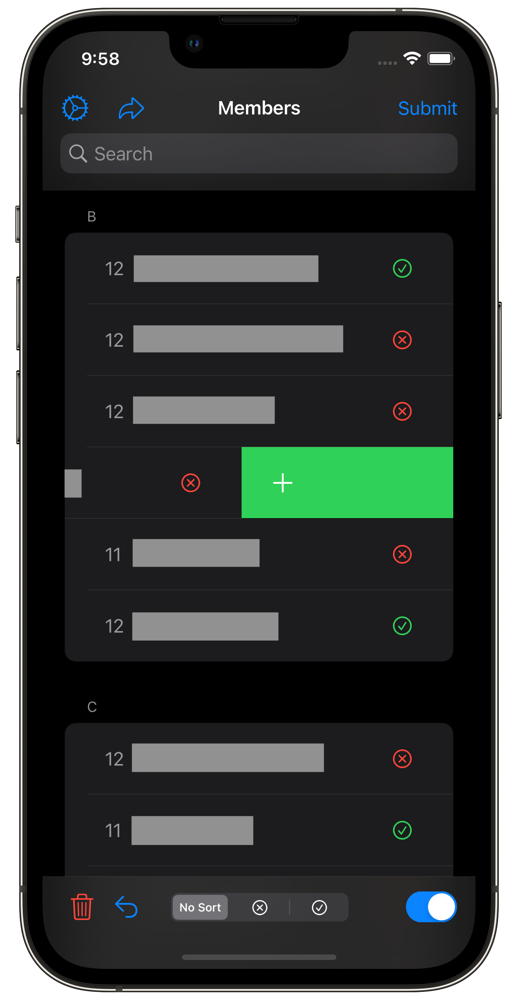
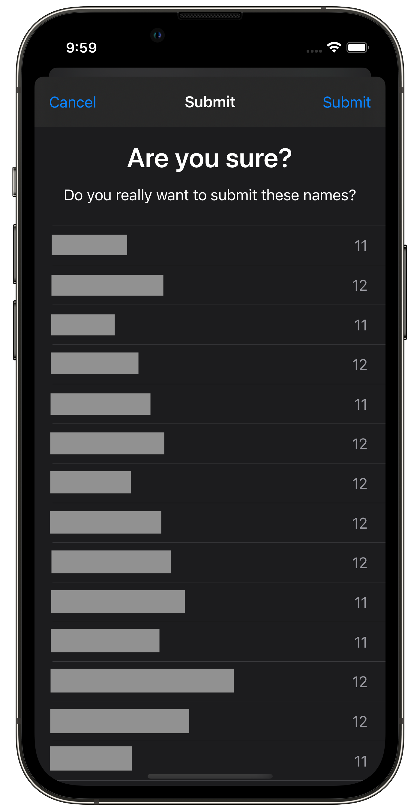
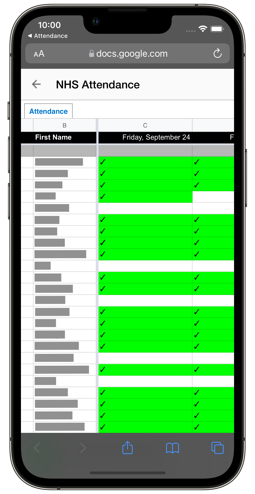
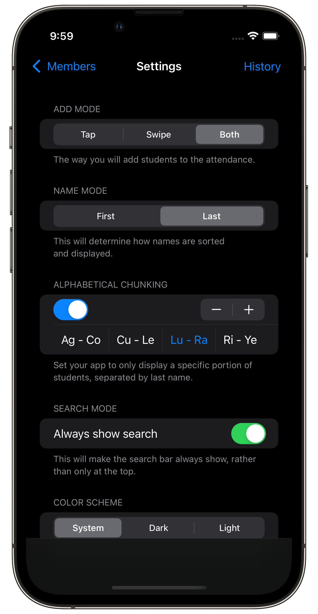

# NHSAttendance

NHSAttendance is an app that simplifies attendance entry, and uploads recorded attendance to a centralized Google Sheet. This allows for multiple board members to each take and upload a portion of the attendance without interfering with the other members. It includes many settings so that users may enter attendance in whichever way is simplest for them.
